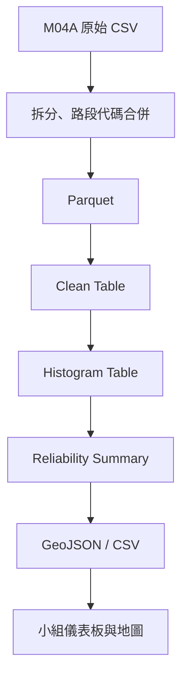

# Highway Travel-Time Reliability Lakehouse

以台灣高速公路 M04A 的車輛行駛時間與車流量為基礎，針對 13 億筆資料進行前處理、Lakehouse 分層建模與旅行時間可靠度分析（Buffer Index）。

> [!IMPORTANT]
> 此專案為小組期末專題，本 GitHub 儲存庫聚焦於我負責的小組簡報第 15–28 頁：可靠度分析，包含可靠度定義、分析維度、流程架構圖、資料結構、細部分析流程、Tableau 分析結果，以及技術問題與解決方式。

## Project Overview

小組專題的目標，是降低用路人在高速公路行駛時對旅行時間的不確定性。因此，本專題針對 2021-06-22 至 2026-06-30 期間的 13 億筆、50 GB 資料執行兩項分析：第一項為可靠度分析，第二項為旅行時間計算。

## My Contribution

我的個人負責內容以小組簡報第 15–28 頁為界，工作如下：

- 規劃高速公路路段行駛時間可靠度的分析架構與資料處理流程。
- 在小組已建置的 Kubernetes 叢集與 Hadoop 環境中，使用 HDFS 儲存 Parquet 與 Warehouse 資料，再透過 Spark 進行運算並建構 Iceberg Lakehouse，設計及建立 Clean、Histogram、Summary 三階段分析資料。
- 整理平假日、五大時段、路段及交通量等分析欄位。
- 將 `calendar.csv` 與 `location.csv` 轉換為 Parquet，並分別依日期與 `pair_id` 整合至分析資料，補充平假日、路段位置、方向及經緯度資訊。
- 以交通量作為權重，計算 Buffer Index。
- 建立四種篩選層級，支援日型、時段與整體比較。
- 檢查日期、路段、資料筆數、缺漏值與彙總結果的一致性。
- 針對可靠度分析 Pipeline 驗證系統架構與運算優化決策，包括 Spark／YARN 資源設定、shuffle partitions、AQE、repartition、`sortWithinPartitions`，並處理 Iceberg clustered writer 錯誤及分區寫入穩定性問題。
- 輸出 GeoJSON 與 Tableau-ready CSV，提供小組負責視覺化的成員串接。

資料處理流程如下：



## Reliability Method

可靠度計算以交通量 `volume` 作為權重，不直接對已彙總的旅行時間列取一般百分位數。

對每一個分析群組，先依 `travel_time_sec` 由小到大排序，計算累積交通量，再找出：

- P50：累積交通量第一次達到總交通量 50% 時的旅行時間。
- P95：累積交通量第一次達到總交通量 95% 時的旅行時間。
- Buffer Time：`P95 - P50`。
- Buffer Index：`(P95 - P50) / P50`。

本專題採用的可靠度分級如下：

| Buffer Index | Level | Interpretation |
|---|---|---|
| `< 0.25` | Stable | 旅行時間相對穩定 |
| `< 0.50` | Normal | 有波動但仍屬一般範圍 |
| `< 1.00` | Unstable | 波動明顯 |
| `>= 1.00` | High Risk | 高度不穩定 |

> 上述門檻是本專題使用的分析規則，不代表所有研究或交通機關的通用標準。

## Analysis Levels

Summary Table 共建立 4 種分析層級：

| Level | Grouping | Rows |
|---|---|---:|
| `L1_DAY_TYPE` | 路段 × 平假日 | 896 |
| `L2_TIME_PERIOD` | 路段 × 時段 | 2,240 |
| `L3_DAY_TYPE_TIME_PERIOD` | 路段 × 平假日 × 時段 | 4,480 |
| `L4_OVERALL` | 路段整體 | 448 |
| **Total** |  | **8,064** |

## Data Model

### Clean Table

主要欄位：

- `pair_id`
- `record_date`
- `record_year`
- `record_month`
- `record_time_minute`
- `day_type`
- `time_period`
- `vehicle_type`
- `travel_time_sec`
- `volume`

資料以 `months(record_date)` 分區，供後續統計與查詢使用。

### Histogram Table

依下列欄位彙總交通量：

- `pair_id`
- `day_type`
- `time_period`
- `vehicle_type_group`
- `travel_time_sec`
- `total_volume`

資料以 `day_type` 與 `time_period` 分區。

`vehicle_type_group` 在目前的可靠度分析中使用 `ALL`，交通量則以 `SUM(volume)` 聚合為 `total_volume`。

### Reliability Summary

主要欄位：

- `summary_level`
- `pair_id`
- `day_type`
- `time_period`
- `p50_travel_time_second`
- `p95_travel_time_second`
- `buffer_time_sec`
- `buffer_index`
- `reliability_level`

資料以 `summary_level` 分區，保存各分析層級的 P50、P95、Buffer Time、Buffer Index 與可靠度分級，並作為 GeoJSON 與 CSV 的輸出來源。

## Repository Structure

```text
.
├── README.md
├── requirements.txt
├── .gitignore
├── docs/
│   └── team-project-final-report.pdf
├── data/
│   ├── reference/
│   │   ├── calendar.csv
│   │   ├── calendar.parquet
│   │   ├── check_data.csv
│   │   ├── location.csv
│   │   └── location.parquet
│   └── output/
│       └── m04a_reliability_summary.csv
├── src/
│   ├── preprocessing/
│   │   ├── 01_split_m04a.py
│   │   ├── 02_merge_gantry_data.py
│   │   └── 03_csv_to_parquet.py
│   ├── pipeline/
│   │   ├── 04_build_clean_table.py
│   │   ├── 05_build_histogram_table.py
│   │   └── 06_build_reliability_summary.py
│   └── export/
│       ├── 07_export_reliability_geojson.py
│       └── 08_export_tableau_csv.py
└── ReliRoute_v2/
    ├── app.py
    ├── requirement.txt
    ├── data/
    │   └── reliability_map.geojson
    ├── static/
    │   ├── css/
    │   └── js/
    └── templates/
```

## Reference Data

| File | Purpose |
|---|---|
| `calendar.csv` / `calendar.parquet` | 日期、年度、月份及平假日分類，依日期與 M04A 資料整合 |
| `check_data.csv` | 歷史路段／門架代碼合併對照 |
| `location.csv` / `location.parquet` | 路段起訖位置、方向及座標，依 `pair_id` 與可靠度資料整合 |

## Output Data

| File | Description |
|---|---|
| `data/output/m04a_reliability_summary.csv` | 可靠度分析最終結果，共 8,064 筆，包含四種 Summary Level、P50、P95、Buffer Time、Buffer Index 與可靠度分級 |
| `ReliRoute_v2/data/reliability_map.geojson` | 將可靠度結果與路段位置、方向及經緯度整合後產生的地圖資料，提供視覺化與前端使用 |

## Environment

Python 前處理程式主要使用：

- Python
- pandas
- PyArrow

分析管線曾在小組提供的環境中搭配以下技術執行：

- Apache Spark / PySpark
- Hadoop HDFS
- YARN
- Apache Iceberg
- Parquet

完整小組專題亦使用 Kubernetes、Flask、Leaflet、HTML、CSS、JavaScript；本儲存庫的技術內容則聚焦於 Spark、YARN、Iceberg，以及可靠度分析管線的資料分區、資源配置與寫入設定。

## Getting Started

請先將 `ReliRoute_v2` 壓縮檔解壓縮，再依照以下步驟開啟前端並查看資料分析結果。

1. 開啟 CMD，進入 `ReliRoute_v2` 資料夾並執行：

   ```bash
   python app.py
   ```

2. 程式啟動後，在瀏覽器網址列輸入 CMD 顯示的 IP 位址與連接埠，即可進入前端頁面查看資料結果，例如：

   ```text
   http://127.0.0.1:5000
   ```

3. 使用完畢後，回到 CMD 並按下 `Ctrl+C`，停止程式並離開。

## Reproducibility and Limitations

原始電腦已格式化，因此本儲存庫中的部分程式是依保存的文字檔、報告內容與分析流程重新整理。它用來呈現資料工程與可靠度分析方法，不保證可完整重建當時的小組部署環境。

## Team Project Report

完整報告請見：

- [Team Project Final Report](docs/team-project-final-report.pdf)

該 PDF 記錄完整的小組專題；本儲存庫所整理的個人技術內容對應報告的第 15–28 頁。

## Attribution

這份專題為小組共同成果，本儲存庫聚焦於我的可靠度分析、數據處理與分析管線優化內容。
